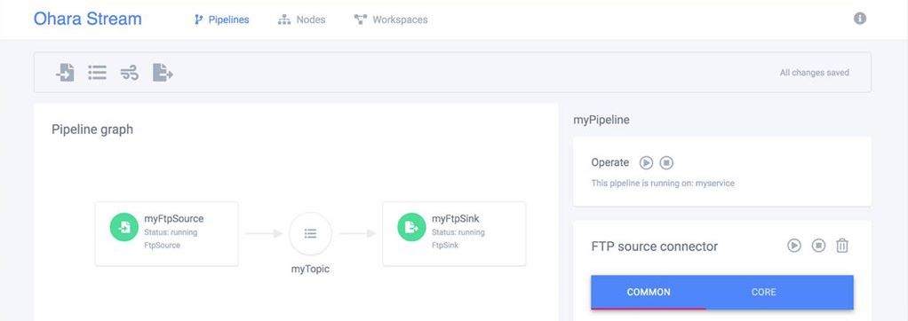

# Ohara

Ohara is an scalable streaming platform, that allows users to easily organized their input, output, and streaming applications with an clean and comprehensive GUI.

The streaming application ([StreamApp](https://ohara.readthedocs.io/en/0.8.x/custom_streamapp.html)) contains the business logic defined by the user. By combining the applications with the default FTP, JDBC, HDFS, or [custom](https://ohara.readthedocs.io/en/0.8.x/custom_connector.html) connectors, an user can construct a scalable pipeline with full control.

Ohara provides an architecture to scale, so the users can focus on their business logic and their main applications.

**Try this [Quick Start Guide](https://ohara.readthedocs.io/en/latest/user_guide.html#quick-start) to empower your business now!**

----

## [Ohara Documentation](https://ohara.readthedocs.io/en/0.8.x)

----

## [中文使用者社群](https://www.facebook.com/groups/oharastream)

----

## Contributing

Ohara is a completely open source project. If you're interested in contributing, you can start from the [contrubting guide](https://ohara.readthedocs.io/en/latest/contributing.html). Also, take a look at our [issue tracker](https://github.com/oharastream/ohara/issues), the [good first issues](https://github.com/oharastream/ohara/issues?q=is%3Aissue+is%3Aopen+label%3A%22good+first+issue%22) would be a good place to start with.

----

## Ohara Team

- **Vito Jeng (vito@is-land.com.tw)** - leader
- **Jack Yang (jack@is-land.com.tw)** - committer
- **Chia-Ping Tsai (chia7712@is-land.com.tw)** - committer
- **Joshua_Lin (joshua@is-land.com.tw)** - committer
- **Sam Cho (sam@is-land.com.tw)** - committer
- **Chih-Chiang Yeh (harryyeh@is-land.com.tw)** - committer
- **Robert Ye (robertye@is-land.com.tw)** - committer

----

## License

Ohara is an open source project and available under the Apache 2.0 License.
