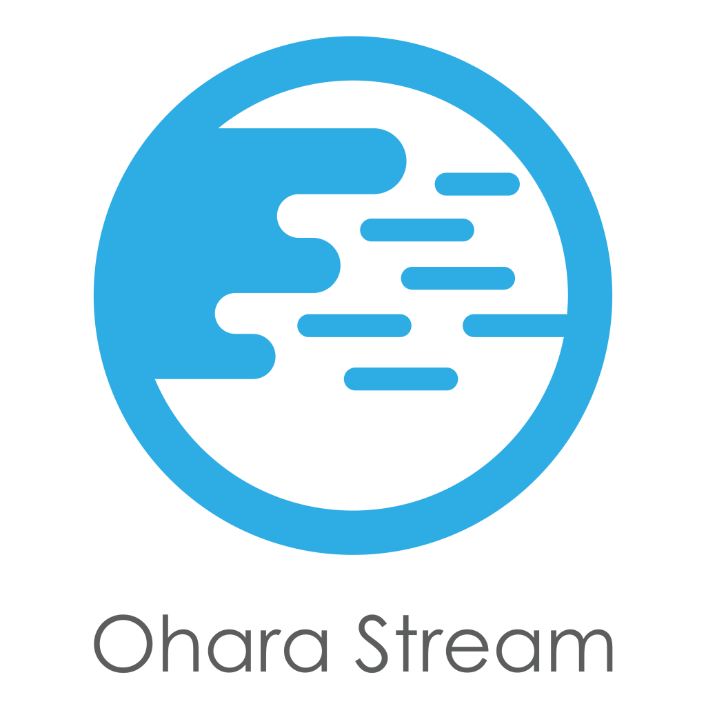

..
.. Copyright 2019 is-land
..
.. Licensed under the Apache License, Version 2.0 (the "License");
.. you may not use this file except in compliance with the License.
.. You may obtain a copy of the License at
..
..     http://www.apache.org/licenses/LICENSE-2.0
..
.. Unless required by applicable law or agreed to in writing, software
.. distributed under the License is distributed on an "AS IS" BASIS,
.. WITHOUT WARRANTIES OR CONDITIONS OF ANY KIND, either express or implied.
.. See the License for the specific language governing permissions and
.. limitations under the License.
..

Documentation
=============

Ohara is open to users, developers and man living in earth. Hence, we prepare a bunch of docs to help you to
understand ohara comprehensively but quickly.

For User
--------

This section is for the ohara users who are going to install and then test official streaming application. For this case,
you don't need to compile, build or write anything for ohara. All you have to read the :ref:`userguide`
and then follow the advice of :ref:`installation section <userguide-installation>`.

For Developer
-------------

If you want to know how to build ohara, please read: :ref:`How to build <Build>`

Apart from contributing code to ohara, you can also leverage ohara to design your
:ref:`custom connector<connector>`, :ref:`custom streamapp<streamapp>`
or build your UI interface via :ref:`Ohara REST interface <Rest>`.

.. toctree::
   :maxdepth: 2
   :caption: Table of Contents

   user_guide
   rest/index
   custom_connector
   custom_streamapp
   setting_definition
   how_to_build
   manager_dev_guide
   docker
   integration_test
   contributing
   contrib-docs/index
   build_quickstart_vm

Indices and tables
==================

* :ref:`genindex`
* :ref:`search`
