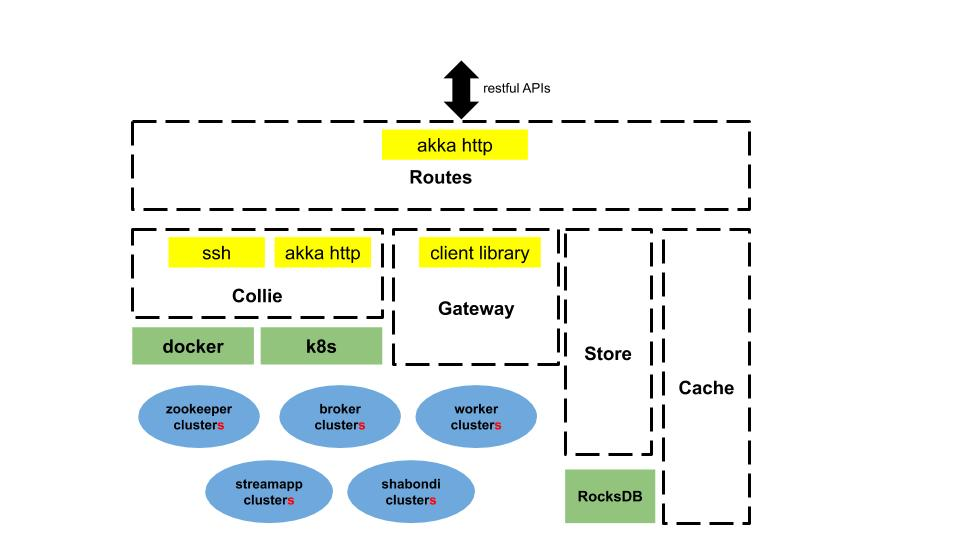
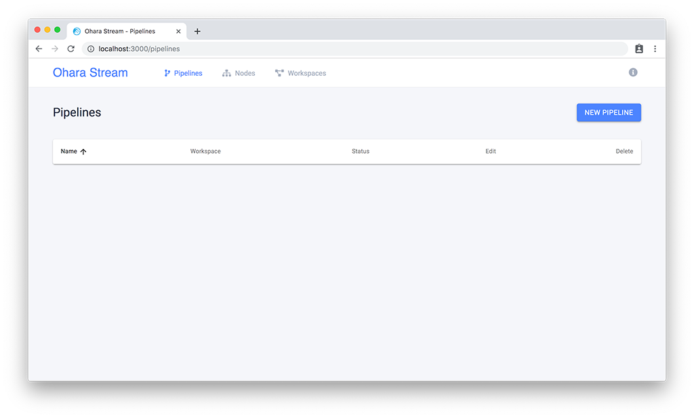
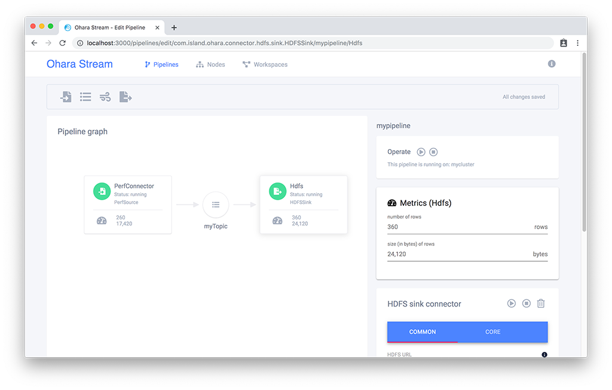
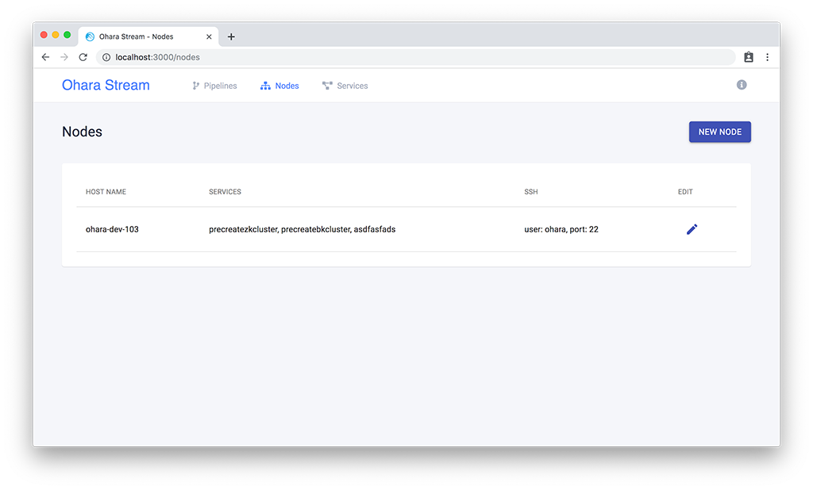
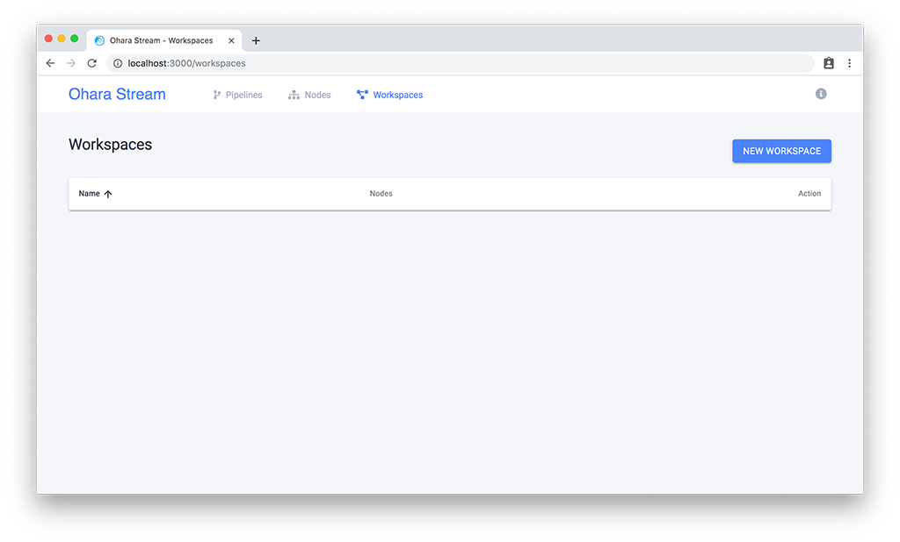
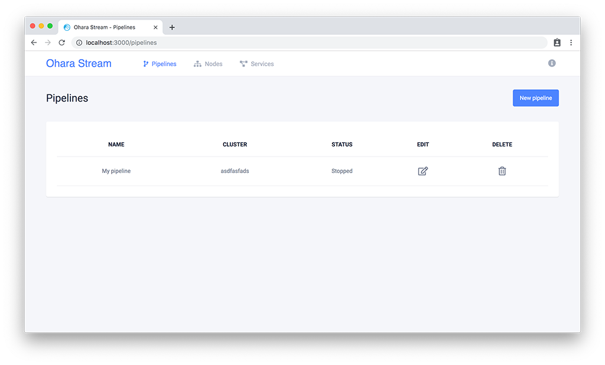
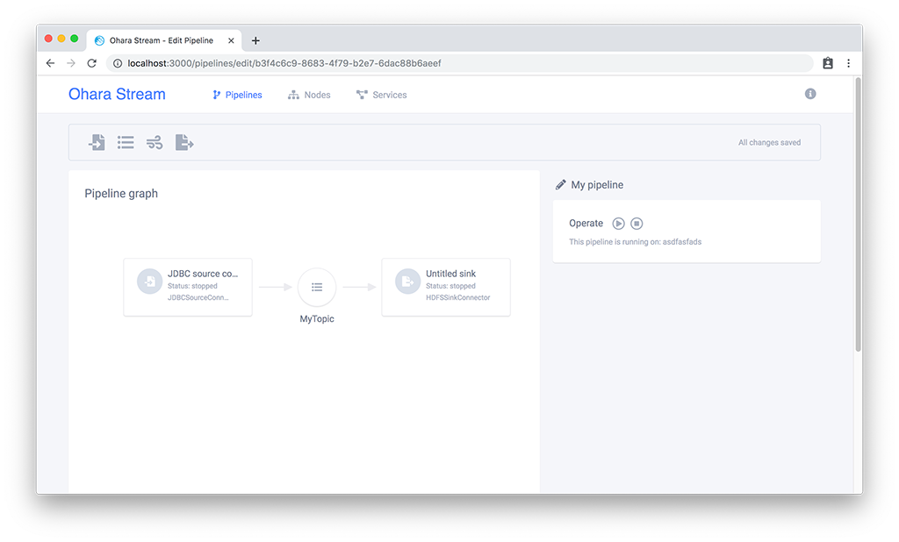

..
.. Copyright 2019 is-land
..
.. Licensed under the Apache License, Version 2.0 (the "License");
.. you may not use this file except in compliance with the License.
.. You may obtain a copy of the License at
..
..     http://www.apache.org/licenses/LICENSE-2.0
..
.. Unless required by applicable law or agreed to in writing, software
.. distributed under the License is distributed on an "AS IS" BASIS,
.. WITHOUT WARRANTIES OR CONDITIONS OF ANY KIND, either express or implied.
.. See the License for the specific language governing permissions and
.. limitations under the License.
..

.. _userguide:

User Guide
==========

:ref:`Hello User Guide <userguide>`

This documentation is for Ohara users who try to exercise or test Ohara
without writing any code. Ohara team design and implement Ohara to
provide a unparalleled platform which enable everyone to build streaming
easily and quickly. For normal users, you can manipulate Ohara through
UI interface even if you have no idea about the magic infra of Ohara.
For advanced users trying to build custom streaming, they are encouraged
to design and write application based on Ohara's various and powerful
APIs (see :ref:`Custom Connector <connector>` and :ref:`Custom Stream <stream>`).

Ohara consists of many services, such as

#. :ref:`Ohara Configurator <userguide-configurator>` — the controller of Ohara. It cooperates other services and provides the :ref:`Restful APIs <rest>`
#. :ref:`Ohara Manager <userguide-ohara-manager>` — the UI service of Ohara. It offers a streaming flow called **pipeline**
#. :ref:`Zookeeper <userguide-zookeeper>` — works for Broker. It has charge of managing the configuration of topics and health of node
#. :ref:`Broker <userguide-broker>` — It provides the access of topics, topics’ data durability and balance.
#. :ref:`Worker <userguide-worker>` — It hosts and execute :ref:`Custom Connector <connector>`
#. :ref:`Docker <userguide-docker>` — It packages the configs, dependencies and binary required by services and execute them in a isolated environments
#. and :ref:`Kubernetes <userguide-k8s>` — a management tool of docker instances

Ohara has a complicated software stack but most services are almost
transparent to you. For example, before creating a topic on Ohara, you
ought to set up a zookeeper cluster and a broker cluster. There are ,
unfortunately, a bunch of configs which you have to design and write for
both cluster. Ohara auto-generates most configs for you as best as it
can, and Ohara offers the the readable :ref:`Restful APIs <rest>` and
friendly UI to you. All complicated configs are replaced by some simple
steps showed on UI. The :ref:`Quick Start <userguide-quickstart>` section teach you
to exercise Ohara easily and quickly.

--------------

.. _userguide-quickstart:

Quick Start
-----------

The core component of Ohara is :ref:`Configurator <userguide-configurator>`.
After installing :ref:`related tools <userguide-installation>`, you can set up a
Configurator via following docker command.

.. code-block:: console

   docker run --rm -p 12345:12345 oharastream/configurator:$|version| --port 12345

.. note::
   click :ref:`here <userguide-execute-configurator>` to see more options for
   configurator

And then you can also create a manager to provide a beautiful UI based
on above Ohara Configurator.

.. code-block:: console

   docker run --rm -p 5050:5050 oharastream/manager:$|version| --port 5050 --configurator http://$ip:12345/v0

.. note::
   Please replace the **ip** by your host’s address

Open your browser (we recommend `Google
Chrome <https://www.google.com/intl/zh-TW/chrome/>`__) and link to
`http://localhost:5050`.

--------------

.. _userguide-installation:

Installation
------------

We all love docker, right? All Ohara services are executed by docker
container. However, it is ok to run Ohara services through
:ref:`assembly file <build-binary>` if you really really really
hate docker.

Network Configurations
^^^^^^^^^^^^^^^^^^^^^^

We are trying to do everything for you. However, your network your
problem (reference to Hadoop’s
`motto <https://wiki.apache.org/hadoop/YourNetworkYourProblem>`__. A bad
network configurations can bring any kind of exception in any time, and
it is hard to diagnose your network problems. In order to make each
container be able to find each other, please ensure following common
problems (reference to
`Hadoop <https://wiki.apache.org/hadoop/YourNetworkYourProblem>`__
again) don’t happen on your nodes.

1. DNS and reverse DNS broken/non-existent.
2. Host tables in the machines invalid.
3. Firewalls in the hosts blocking connections.
4. Routers blocking traffic.
5. Hosts with multiple network cards listening/talking on the wrong NIC.
6. Difference between the hadoop configuration files’ definition of the
   cluster (especially hostnames and ports) from that of the actual
   cluster setup.

After validating your network configurations layer by layer, you could
try filing issue on github if you still can’t get Ohara to work.

**We often encounter problems with network problems**

After install Docker-ce package in CentOS,the network default policy is
block docker’s bridge to host network, You **must** add a rule on the
firewall:

.. code-block:: console

   sudo firewall-cmd --zone=trusted --permanent --add-interface=docker0

Install Docker-ce on CentOS
^^^^^^^^^^^^^^^^^^^^^^^^^^^

Docker has provided a great docs about installing docker-ce. Please
click this
`link <https://docs.docker.com/install/linux/docker-ce/centos/>`__.

.. _userguide-download-images:

Download Ohara Images
^^^^^^^^^^^^^^^^^^^^^

Ohara deploys docker images on `docker
hub <https://hub.docker.com/u/oharastream>`__. You can download images
via ``docker pull`` command. All images are list below.

#. oharastream/broker:|version|
#. oharastream/zookeeper:|version|
#. oharastream/connect-worker:|version|
#. oharastream/configurator:|version|
#. oharastream/manager:|version|
#. oharastream/stream:|version|

.. _userguide-execute-configurator:

Execute Configurator
^^^^^^^^^^^^^^^^^^^^

.. code-block:: console

   docker run --rm -p ${port}:${port} --add-host ${nodeHostName}:${nodeHostIP} oharastream/configurator:$|version| --port ${port} --hostname ${host}

-  ``--folder``: the folder used to store data (default is random). Mount the
   volume if you want to keep your data after restarting Configurator
-  ``--port``: bound by Configurator (default is random)
-  ``--add-host``: add a host mapping to /etc/hosts in Ohara Configurator (nodeHostName:nodeHostIP).
   If you have DNS server, you can just ignore parameter of add-host.
-  ``--hostname``: hostname to run Ohara Configurator (defaults to 0.0.0.0)

.. note::
  You can enable the jmx reporter via inputting two env variables - “JMX_HOSTNAME” and “JMX_PORT”.

  - “JMX_HOSTNAME” should be same as the host running Ohara Configurator container so as to access
    the jmx service in docker from outside.
  - “JMX_PORT” should be opened by docker (for example, add “-p $JMX_PORT:JMX_PORT”)

All services host by Ohara Configurator are based on docker
technique. By default Ohara Configurator use ssh to control the
docker containers from remote nodes (see :ref:`Docker <userguide-docker>`
section). In this mode, please make sure the ssh account added by
:ref:`Node APIs <rest-nodes>` should have sudo permission
to run docker command (see
`here <https://docs.docker.com/install/linux/linux-postinstall/>`__
for related steps).

.. _userguide-configurator-data:

**Keep the data of Configurator**

Ohara Configurator demand a folder to store :ref:`data <rest>`
and :ref:`jars <rest-files>`. As Ohara Configurator is
running in docker container, you have to mount the volume, which is
located on container host, on the home folder of Ohara Configurator if
you want to keep all data of Ohara Configurator. The following example
is to mount a local folder (/tmp/configurator) on
/home/ohara/configurator of Ohara Configurator's container.

.. code-block:: console

   $ mkdir /tmp/configurator
   $ docker run -v /tmp/configurator:/home/ohara/configurator \
            -p 12345:12345 \
            oharastream/configurator:$|version| \
            --port 12345 \
            --folder /home/ohara/configurator

The user account in docker container is **ohara**, and hence it would be
better to set the folder under the **/home/ohara**. Otherwise, you will
encounter the permission error. Noted that you have tell Ohara
Configurator to save data in the folder referencing to the outside
folder. Otherwise, Ohara Configurator flush all data to a random folder.

**How to solve the start configurator container permission denied issue?**

1. You must confirm your host username is the ohara and UID is 1000. Please refer to issue `#2573 <https://github.com/oharastream/ohara/issues/2573>`__
2. Please confirm the /tmp/configurator host path owner is ohara user and have to write permission.

Execute Manager
^^^^^^^^^^^^^^^

.. code-block:: console

   docker run --rm -p 5050:5050 oharastream/manager:$|version| --port 5050 --configurator http://localhost:12345/v0

-  ``--port``: bound by manager (default is 5050)
-  ``--configurator``: basic form of restful API of Ohara Configurator

Execute PostgreSQL Instance
^^^^^^^^^^^^^^^^^^^^^^^^^^^

::

   docker run -d --rm --name postgresql -p 5432:5432 --env POSTGRES_DB=${DB_NAME} --env POSTGRES_USER=${USER_NAME} --env POSTGRES_PASSWORD=${PASSWORD} -it islandsystems/postgresql:9.2.24

-  POSTGRES_DB: PostgreSQL DataBase name
-  POSTGRES_USER: PostgreSQL login user name.
-  POSTGRES_PASSWORD: PostgreSQL login password.

.. note::
   POSTGRES_USER=“user” is illegal to postgresql

Execute FTP Instance
^^^^^^^^^^^^^^^^^^^^

.. code-block:: console

   docker run --rm -p 10000-10011:10000-10011 oharastream/backend:$|version| oharastream.ohara.testing.service.FtpServer --controlPort 10000 --dataPorts 10001-10011 --user ${UserName} --password ${Password} --hostname ${hostIP or hostName}

-  controlPort: bound by FTP Server
-  dataPorts: bound by data transportation in FTP Server

--------------

.. _userguide-configurator:

Ohara Configurator
------------------

Ohara consists of many services, and Ohara Configurator plays the most
important rule which coordinates all services and offers a bunch of
restful APIs to user to get all under control. The brief architecture of
Ohara Configurator is shown below.

   Configurator architecture

The introduction of each components are shown below. Feel free to trace
the component in which you have interest.

- :ref:`Route of Ohara Configurator <userguide-configurator-route>`
- :ref:`Store of Ohara Configurator <userguide-configurator-store>`
- :ref:`Cache of Ohara Configurator <userguide-configurator-cache>`
- :ref:`Collie of Ohara Configurator <userguide-configurator-collie>`
- :ref:`Client of Ohara Configurator <userguide-configurator-client>`

.. _userguide-configurator-route:

Route of Ohara Configurator
^^^^^^^^^^^^^^^^^^^^^^^^^^^

Ohara Configurator leverages the akka-http to implements the rest server
and handle the conversion of json objects. You can click our
:ref:`RESTful API docs <rest>` to see all public APIs and introduction.

The APIs supported by Ohara Configurator is only the Restful APIs. Of
course, you can raise a question to us - why we choose the Restful APIs
rather than pure Java APIs? The answer is - We all hate the other
programming language except for the one we are using. However, we always
need to work with other people who are typing terrible and weird code,
and all they want to do is to call your APIs. In order to save our time
from co-working with them, providing the Restful APIs is always to be
our solution. For another reason, Ohara Configurator is not in charge of
I/O flow. Coordinating all services requires small bandwidth only. We
don’t need to care for the performance issue about Restful APIs.

   You can use our internal scala APIs to control Configurator. The
   library is called ohara-client and it covers all Restful APIs of
   Configurator. However, we don’t guarantee any compatibility for
   ohara-client.

.. _userguide-configurator-store:

Store of Ohara Configurator
^^^^^^^^^^^^^^^^^^^^^^^^^^^

All settings you request to Ohara Configurator are saved in Store, such
as connector settings, cluster information and pipeline description. The
default implementation of Store is `RocksDB <https://rocksdb.org/>`__
which offers fast in-memory access and persists all data on disk. Please
read this :ref:`section <userguide-configurator-data>` about mounting
host’s folder on docker container.

.. _userguide-configurator-cache:

Cache of Ohara Configurator
^^^^^^^^^^^^^^^^^^^^^^^^^^^

The cost of coordinating countless services is the big **latency**. For
example, :ref:`Topic APIs <rest-topics>` allows you to fetch
metrics from different :ref:`broker clusters <rest-brokers>`.
Ohara Configurator has to file a bunch of connections to different
clusters to retrieve all requisite information, and, of course, the
**connections** bring the large latency to the GET request. Hence, Ohara
Configurator sets up a inner cache which stores the data from remote
clusters. It reduces the latency from seconds to milliseconds and allay
your anger. In order to make all data up-to-date as much as possible,
the cache auto-refreshes timeout data in the background. It brings some
extra cost of building connections to remote clusters.

.. _userguide-configurator-collie:

Collie of Ohara Configurator
^^^^^^^^^^^^^^^^^^^^^^^^^^^^

Apart from the data flow, Ohara Configurator is also doable to manage
clusters for you. For instance, you can

#. add :ref:`node <rest-nodes>` to Ohara Configurator
#. deploy a :ref:`zookeeper cluster <rest-zookeepers>` on the node
#. deploy a :ref:`broker cluster <rest-brokers>` on the node as well
#. deploy a :ref:`worker cluster <rest-workers>` on the node
#. finally, you can run a connector to stream your data and all services you have created are hosted by Ohara Configurator

In order to host your services safely and quickly, Ohara Configurator
leverages the Docker technique that all services are packaged to a
container and executed on the node(s) specified by you. As a good
software stack, Ohara Configurator creates a container manager, which is
called **collie**, to wrap Restful APIs of :ref:`k8s <userguide-k8s>` and ssh
command to Scala APIs.

.. _userguide-configurator-client:

Client of Ohara Configurator
^^^^^^^^^^^^^^^^^^^^^^^^^^^^

As a good programmer, we all love to reuse the code. However, it is hard
to trust all third-party libraries guarantee the suitable compatibility
policy. The Client code in Ohara is a collection of wrap for all client
codes to services, such as broker and worker, so as not to be badly hurt
by the update of services.

--------------

.. _userguide-ohara-manager:

Ohara Manager
-------------

Ohara Manager is the user interface (UI) of Ohara. It’s built with the
standard web technologies and so can be run in almost all the modern
browsers (We recommend you to use Google chrome though). Ohara Manager
talks to Ohara Configurator via its RESTful APIs under the hook which
then connects with the rest of Ohara services.

Ohara Manager was built and designed with the user’s needs in mind. We
aimed to reduce the pain of complex operations that often required in a
big data system. With Ohara Manager, you can create your own services,
pipelines and working with data streaming without touching a single line
of code.

**Following is a quick walk through of Ohara Manager’s user interface:**

Pipelines
^^^^^^^^^

Pipeline list page is where you can view, create, edit and delete
pipelines.

Inside the new/edit pipeline page, you can create and play around with
your pipelines here. This is also where you can run and stop your
pipelines. The pipeline graph helps you to easily visualize the pipeline that
you’re working on. Also, you can edit and tweak a connector’s configuration by clicking
on the graph and edit the configuration form which will be displayed in the
sidebar. We know it’s sometimes tedious and time consuming to edit the
configuration and it’s also frustrating when you lose all of your configuration without
saving them! That’s why we made these configuration forms automatically save
changes for you. Whenever you type in a text field, choose a new topic
form a dropdown, the changes will be saved immediately.

   Please note that a pipeline can only be added to a workspace, so before
   creating pipelines, you will need to `create a workspace first <#userguide-ohara-manager-workspaces>`_

Nodes
^^^^^

This is where you create and edit Ohara Nodes. These nodes are usually
your VMs. When you’re starting a new Ohara Configurator. You can
optionally supply some node information with the CLI command. The node
you supplied to the CLI will then be listed in this page.

.. _userguide-ohara-manager-workspaces:

Workspaces
^^^^^^^^^^

A workspace contains multiple Ohara services including: Zookeepers, Brokers and Workers. You can
create a workspace and add new node, topic and stream application in these pages.

   Ohara Manager Workspaces page

-  **Overview**:

   Overview page is like a dashboard of the workspace. You can view the services, connectors, topics
   and stream jars that are using in this workspace

   .. figure:: images/workspaces_overview.png
      :alt: Ohara Manager Workspaces Overview page

-  **Nodes**:

   When creating a workspace, you can choose which node to deploy your services. But you tweak the
   node settings here.

   .. figure:: images/workspaces_nodes.png
      :alt: Ohara Manager Workspaces Nodes page

-  **Topics**:

   You can add new topics to your workspace as well as deleting them here.

   .. figure:: images/workspaces_topics.png
      :alt: Ohara Manager Workspaces Topics page

-  **Stream jars**:

   Same like the topics page, you can add and delete stream jars in this page

   .. figure:: images/workspaces_stream_jars.png
      :alt: Ohara Manager Workspaces Stream App page

If you’d like to learn more about the development setup or have issue
starting/working with it. Please see Ohara Manager's :ref:`Development Guideline <managerdev>`

--------------

.. _userguide-zookeeper:

Zookeeper
---------

`Zookeeper <https://zookeeper.apache.org/>`__ plays an important role in
Ohara that it persists metadata for kafka and monitors the running nodes
of kafka. Setting up a zookeeper cluster is always the first phase
before you start to use Ohara to host your clusters. It may be weird,
however, to you since this cryptic service is almost transparent to you.
Currently, zookeeper cluster exists only for kafka. At any rate, you are
still doable to access zookeeper via any zk client if you have to.

As a result of algorithm used by zookeeper, we recommend your zookeeper
cluster should have 2n + 1 nodes which can address the best reliability
and availability (`related
discussion <https://stackoverflow.com/questions/4228227/what-does-2n-1-quorum-mean>`__).
In most cases, running a zookeeper cluster with 3 servers is enough to
your production because we don’t put our data flow on zookeeper cluster.
However, you should consider higher number of nodes if your production
does care for the recovery time of node crash. More nodes in zookeeper
cluster brings more time to you for fixing your broken zookeeper
cluster.

Ohara is responsible for creating your zookeeper cluster, and hence
Ohara also auto-generate most configs used by a zookeeper cluster. A
basic auto-generated configs file to zookeeper cluster is shown below.

::

   tickTime=2000
   initLimit=10
   syncLimit=5
   maxClientCnxns=60
   clientPort=2181
   dataDir=/tmp/zookeeper/data
   server.0=node00:2888:3888

Most options are auto-generated by Ohara Configurator, and and
:ref:`Zookeeper APIs <rest-zookeepers-create-properties>`
displays the configurable settings to user.. Feel free to file an issue
to Ohara community if you have better configs for zookeeper.

--------------

.. _userguide-broker:

Broker
------

After setting up a :ref:`Zookeeper cluster <userguide-zookeeper>`, you have to build
a broker cluster before going on your streaming trip.
`Broker <https://kafka.apache.org/intro>`__ is the streaming center of
Ohara that all applications on Ohara goes through brokers to switch
data. There are many stories about Ohara leverages the broker to
complete countless significant works. But the most important usage of
Brokers for Ohara is the :ref:`Topic <rest-topics>`. Each
endpoint in :ref:`Pipeline <rest-pipelines>` must connect
to/from a topic, and each topic in Ohara is mapped to a topic in broker.
It means all data sent/received to/from topic is implemented by a true
connection to a broker.

As a result of addressing scalability, a topic is split to many
**partitions** distributed on different brokers. It implies the number
of brokers directly impact the performance of Ohara
:ref:`Pipeline <rest-pipelines>`. If you are streaming a
bunch of data and there is only a broker in your broker cluster, you
will get a slow streaming since all data in the streaming are processed
by the single broker. Hence, please be careful on deploying your broker
cluster. But you don’t worry about the incorrect settings to cluster.
Ohara provides many flexible :ref:`Broker APIs <rest-brokers>` to increase/decrease nodes of a
running broker cluster. You are able to scale your cluster up/down
arbitrarily via Ohara APIs.

In order to simplify your life, Ohara auto-generate most configs for
your broker cluster.

::

   num.network.threads=3
   num.io.threads=8
   socket.send.buffer.bytes=102400
   socket.receive.buffer.bytes=102400
   socket.request.max.bytes=104857600
   num.partitions=1
   num.recovery.threads.per.data.dir=1
   offsets.topic.replication.factor=1
   transaction.state.log.replication.factor=1
   transaction.state.log.min.isr=1
   log.retention.hours=168
   log.segment.bytes=1073741824
   log.retention.check.interval.ms=300000
   zookeeper.connection.timeout.ms=6000
   group.initial.rebalance.delay.ms=0
   broker.id=0
   listeners=PLAINTEXT://:9092
   log.dirs=/tmp/broker/data
   zookeeper.connect=node00:2181
   advertised.listeners=PLAINTEXT://node00:9092

Most options are auto-generated by Ohara Configurator, and
:ref:`Broker APIs <rest-brokers-create>` displays the
configurable settings to user. Ohara community always welcomes user to
raise issue about **we should give a better default configs** or **we
should enable user to change xxx config**.

--------------

.. _userguide-worker:

Worker
------

In contrast with :ref:`Broker <userguide-broker>`, Worker takes charge of hosting
and distributing your applications. Via Ohara Configurator you can
deploy applications on a worker cluster. Worker executes your
application on a single thread and handle following issues for you.

1. tolerance - worker cluster auto-migrate your application from a dead
   node to another live one.
2. distribution - you can decide the number of threads invoked by worker
   cluster to run your applications. Of course, the threads are
   distributed across whole cluster.
3. Data - Worker is in charge of fetching/pushing data from/to topics
   specified by your application. All you have to do is to process the
   data.
4. consistency - The offset of data in/from topics are auto-record by
   worker. Also, for advanced user, there are a lot of offset-related
   APIs, which is exposed to your application, that you can control the
   offsets of data. 1.balance - worker cluster keeps tracing the loading
   for each worker node and auto-balance the loading for heavy one. Via
   :ref:`Ohara APIs <rest-workers>`, you can increase the
   node of a running worker cluster easily if you do want to scala the
   throughput up.

Setting up a worker cluster also requires many configurations. Ohara
Configurator auto-fill the following settings for you when you request
to create a worker cluster.

::

   key.converter=org.apache.kafka.connect.json.JsonConverter
   value.converter=org.apache.kafka.connect.json.JsonConverter
   key.converter.schemas.enable=true
   value.converter.schemas.enable=true
   offset.flush.interval.ms=10000
   internal.key.converter=org.apache.kafka.connect.json.JsonConverter
   internal.value.converter=org.apache.kafka.connect.json.JsonConverter
   internal.key.converter.schemas.enable=false
   internal.value.converter.schemas.enable=false
   group.id=339f4352b3
   offset.storage.topic=offset-8e5c68825d
   offset.storage.replication.factor=1
   offset.storage.partitions=1
   config.storage.topic=setting-2b86167398
   config.storage.replication.factor=1
   status.storage.topic=status-4841be564b
   status.storage.replication.factor=1
   status.storage.partitions=1
   plugin.path=/tmp/plugins
   bootstrap.servers=node00:9092
   rest.port=8083
   rest.advertised.host.name=node00
   rest.advertised.port=8083

Most options are auto-generated by Ohara Configurator, and
:ref:`Worker APIs <rest-workers-create>` displays the
configurable settings to user. Welcome you to file an issue to request
more control right of worker cluster.

--------------

.. _userguide-docker:

Docker
------

All services host by Ohara are based on docker containers, such as
:ref:`Configurator <userguide-configurator>`,
:ref:`Manager <userguide-ohara-manager>`,
:ref:`Zookeeper <userguide-zookeeper>`,
:ref:`Broker <userguide-broker>` and
:ref:`Worker <userguide-worker>`. You should install suggested version of Docker
before enjoying Ohara service (see `how to build <how_to_build.md>`__
for prerequisite).

The post-installation for all docker nodes are listed below.

#. :ref:`Install the supported version of docker <build-prerequisites>` —
    Ohara community does not support the legacy docker.
#. :ref:`download all ohara images <userguide-download-images>` —
    Ohara Configurator expect all images are available from local disk rather than network.
#. `create a user account which can access docker without sudo <https://docs.docker.com/install/linux/linux-postinstall/>`__ —
    Ohara Configurator may use ssh to control docker of remote node.

.. note::
  all containers created by Ohara, which is on docker mode, have a specific label - createdByOhara - this label enables
  Ohara to ignore the unrelated containers. For examples, You request Ohara Configurator (of course, it is on docker mode)
  to create a zookeeper service. The container of zookeeper service will have label - createdByOhara=docker.

--------------

.. _userguide-k8s:

Kubernetes
----------

Kubernetes is a managed container platform. It can across different
container communication of a node. solve more deploy multiple a node
container problems, below is Kubernetes advantage:

- Automatically deploy Docker container
- Docker container resource manage and scaling
- Orcherstrate docker container on multiple hosts

About details please refer:
https://kubernetes.io/docs/concepts/overview/what-is-kubernetes/

Ohara builds multiple docker images. This includes zookeeper,
broker, and connect-worker. These services can be run and controlled
through Kubernets and making container management a lot easier. Before
running any Ohara containers, you need to install Kubernets first.
We’ll walk you through this process with a few k8s commands:

.. note::
  all containers created by Ohara, which is on k8s mode, have a specific label - createdByOhara - this label enables
  Ohara to ignore the unrelated containers. For examples, You request Ohara Configurator (of course, it is on k8s mode)
  to create a zookeeper service. The container of zookeeper service will have label - createdByOhara=k8s.

Install distribute mode for Kubernetes
^^^^^^^^^^^^^^^^^^^^^^^^^^^^^^^^^^^^^^

**Kubernetes hardware requirement**

Note: Ohara support install Kubernetes shell script OS only CentOS7

-  2 CPUs or more
-  2 GB or more of RAM per machine
-  Full network connectivity between all machines in the cluster
-  Swap disabled

More details is `here <https://kubernetes.io/docs/setup/independent/install-kubeadm/#before-you-begin>`_

**1. Install Kubernetes master**

-  Switch to root user

**Why change to root user?**

Use the root user to install Kubernetes is simple and convenient.
Avoid changing not an admin user. Of course, you can use the admin user
and add the "sudo" keyword to execute install the Kubernetes shell script.

.. code-block:: console

   $ su root

-  Change directory to ``kubernetes/distribute``

.. code-block:: console

   # cd $OHARA_HOME/kubernetes/distribute

-  Run ``bash k8s-master-install.sh ${Your_K8S_Master_Host_IP}`` to
   install Kubernetes master

.. code-block:: console

   # bash k8s-master-install.sh ${Your_K8S_Master_Host_IP}

-  Token and hash will be used in worker installation later on

.. code-block:: console

   # cat /tmp/k8s-install-info.txt

The token and hash should look like the following:

.. code-block:: console

   # kubeadm join 10.100.0.178:6443 --token 14aoza.xpgpa26br32sxwl8 --discovery-token-ca-cert-hash sha256:f5614e6b6376f7559910e66bc014df63398feb7411fe6d0e7057531d7143d47b

..

   **Token:** 14aoza.xpgpa26br32sxwl8

   **Hash:**
   sha256:f5614e6b6376f7559910e66bc014df63398feb7411fe6d0e7057531d7143d47b

**2. Install Kubernetes worker**

-  Switch to root

::

   $ su root

-  Change directory to ``--> kubernetes/distribute``

.. code-block:: console

   # cd $OHARA_HOME/kubernetes/distribute 

-  Run
   ``bash k8s-worker-install.sh ${Your_K8S_Master_Host_IP} ${TOKEN} ${HASH_CODE}``
   command in your terminal. (TOKEN and HASH_CODE can be found in the
   /tmp/k8s-install-info.txt file of Kubernetes master, the one we
   mention in the previous steps)

   Below is example command:

   .. code-block:: console

      # bash k8s-worker-install.sh 10.100.0.178 14aoza.xpgpa26br32sxwl8 sha256:f5614e6b6376f7559910e66bc014df63398feb7411fe6d0e7057531d7143d47b

**3. Ensure the K8S API server is running properly**

Log into Kubernetes master and use the following command to see if these Kubernetes nodes are running properly:

.. code-block:: console

   # kubectl get nodes

-  You can check Kubernetes node status like the following:

.. code-block:: console

   # curl -X GET http://${Your_K8S_Master_Host_IP}:8080/api/v1/nodes

**4. How to autostart the Kubernetes API proxy server after reboot server?**

- Copy "ohara/kubernetes/k8sproxyserver.service" file to your Kubernetes master server "/etc/systemd/system" path

- Below is setting autostart the command to run the Kubernetes API proxy server ``(default port is 8080)``:

.. code-block:: console

   # systemctl enable k8sproxyserver.service
   # systemctl start k8sproxyserver.service

How to use Kubernetes in Ohara?
^^^^^^^^^^^^^^^^^^^^^^^^^^^^^^^

- You must create the service to Kubernetes for DNS use in kubernetes master host,
  Below is the command:

.. code-block:: console

   cd $OHARA_HOME/kubernetes
   kubectl create -f dns-service.yaml

- Below is an example command to run Ohara configurator service
  for K8S mode:

.. code-block:: console

   # docker run --rm \
                -p 5000:5000 \
                --add-host ${K8S_WORKER01_HOSTNAME}:${K8S_WORKER01_IP} \
                --add-host ${K8S_WORKER02_HOSTNAME}:${K8S_WORKER02_IP} \
                oharastream/configurator:$|version| \
                --port 5000 \
                --hostname ${Start Configurator Host Name} \
                --k8s http://${Your_K8S_Master_Host_IP}:8080/api/v1

..

   ``--add-host``: Add all k8s worker hostname and ip information to
   configurator container /etc/hosts file. If you have DNS server, you
   can just ignore parameter of ``--add-host``.

   ``--k8s-namespace``: If you don't use the Kubernetes default namespace,
   you can assign the --k8s-namespace argument to set other the Kubernetes namespace.
   Kubernetes namespace default value is "default" string

   ``--k8s-metrics-server``: If you have installed the Kubernetes metrics
   server, you can set metrics server URL to monitor your Kubernetes node
   resource. Example: ``--k8s-metrics-server http://ohara-kubernetes:8080/apis``

   ``--k8s``: Assignment your K8S API server HTTP URL

-  Use Ohara configurator to create a zookeeper and broker in Kubernetes
   pod for the test:

.. code-block:: console

   # Add Ohara Node example
   $ curl -H "Content-Type: application/json" \
          -X POST \
          -d '{"hostname": "${K8S_WORKER01_HOSTNAME}", \
               "port": 22, \
               "user": "${USERNAME}", \
               "password": "${PASSWORD}"}' \
          http://${CONFIGURATOR_HOSTNAME_OR_IP}:5000/v0/nodes

   $ curl -H "Content-Type: application/json" \
          -X POST \
          -d '{"hostname": "${K8S_WORKER02_HOSTNAME}", \
               "port": 22, \
               "user": "${USERNAME}", \
               "password": "${PASSWORD}"}' \
          http://${CONFIGURATOR_HOSTNAME_OR_IP}:5000/v0/nodes

   # You must pre pull docker image in the ${K8S_WORKER01_HOSTNAME} and ${K8S_WORKER02_HOSTNAME} host, Below is command:
   docker pull oharastream/zookeeper:$|version|
   docker pull oharastream/broker:$|version|

   # Create Zookeeper cluster service
   $ curl -H "Content-Type: application/json" \
          -X POST \
          -d '{"name": "zk", \
               "clientPort": 2181, \
               "imageName": "oharastream/zookeeper:$|version|", \
               "peerPort": 2000, \
               "electionPort": 2001, \
               "nodeNames": ["${K8S_WORKER01_HOSTNAME}"]}' \
          http://${CONFIGURATOR_HOSTNAME_OR_IP}:5000/v0/zookeepers

   # Start Zookeeper cluster service
   $ curl -H "Content-Type: application/json" -X PUT http://${CONFIGURATOR_HOSTNAME_OR_IP}:5000/v0/zookeepers/zk/start

   # Create Broker service example
   $ curl -H "Content-Type: application/json" \
          -X POST \
          -d '{"name": "bk", \
               "clientPort": 9092, \
               "zookeeperClusterName": "zk", \
               "nodeNames": ["${K8S_WORKER02_HOSTNAME}"]}' \
          http://${CONFIGURATOR_HOSTNAME_OR_IP}:5000/v0/brokers

   # Start Broker cluster service
   $ curl -H "Content-Type: application/json" -X PUT http://${CONFIGURATOR_HOSTNAME_OR_IP}:5000/v0/brokers/bk/start

-  You can use the kubectl command to get zookeeper and broker pod
   status with the following command:

.. code-block:: console

   # kubectl get pods

How to install K8S metrics server?
^^^^^^^^^^^^^^^^^^^^^^^^^^^^^^^^^^

- You must install the git command to pull the Kubernetes metrics server source
  code from the repository to deploy metrics server, below is sample command:

.. code-block:: console

   # yum install -y git

- After complete install git, you can pull the K8S metrics server source code,
  below is sample command:

.. code-block:: console

   # git clone https://github.com/kubernetes-sigs/metrics-server.git

- Below is YAML file to override the deploy/kubernetes/metrics-server-deployment.yaml path file

.. code-block:: console

   ---
   apiVersion: v1
   kind: ServiceAccount
   metadata:
     name: metrics-server
     namespace: kube-system
   ---
   apiVersion: apps/v1
   kind: Deployment
   metadata:
     name: metrics-server
     namespace: kube-system
     labels:
       k8s-app: metrics-server
   spec:
     selector:
       matchLabels:
         k8s-app: metrics-server
     template:
       metadata:
         name: metrics-server
         labels:
           k8s-app: metrics-server
       spec:
         serviceAccountName: metrics-server
         volumes:
         # mount in tmp so we can safely use from-scratch images and/or read-only containers
         - name: tmp-dir
           emptyDir: {}
         containers:
         - name: metrics-server
           command:
           - /metrics-server
           - --kubelet-preferred-address-types=InternalIP
           - --kubelet-insecure-tls
           image: k8s.gcr.io/metrics-server-amd64:v0.3.6
           args:
             - --cert-dir=/tmp
             - --secure-port=4443
           ports:
           - name: main-port
             containerPort: 4443
             protocol: TCP
           imagePullPolicy: Always
           volumeMounts:
           - name: tmp-dir
             mountPath: /tmp

- Deploy the Kubernetes metrics server, below is the command:

.. code-block:: console

   # kubectl apply -f deploy/kubernetes

- Confirm the Kubernetes metrics service is installed complete, you can input the
  URL to the browser, below is the example:

.. code-block:: console

   http://${Your_Kubernetes_Master_HostName_OR_IP}:8080/apis/metrics.k8s.io/v1beta1/nodes

You maybe wait seconds time to receive the Kubernetes node metrics data.

How to revert K8S environment setting?
^^^^^^^^^^^^^^^^^^^^^^^^^^^^^^^^^^^^^^

-  You must stop the K8S API server with this command: ``kubeadm reset``
   command

-  More details
   `here <https://kubernetes.io/docs/reference/setup-tools/kubeadm/kubeadm-reset>`__

How to get the log info in container for debug?
^^^^^^^^^^^^^^^^^^^^^^^^^^^^^^^^^^^^^^^^^^^^^^^

-  First, log into Kubernetes’ master server

-  List all Kubernetes pod name to query

.. code-block:: console

   # kubectl get pods

-  Get log info in container

.. code-block:: console

   # kubectl logs ${Your_K8S_Pod_Name}

Other
^^^^^

-  Ohara K8SClient ImagePullPolicy default is IfNotPresent.

-  Please remember to start K8S API server after you reboot the K8S
   master server:

.. code-block:: console

   # nohup kubectl proxy --accept-hosts=^*$ --address=$Your_master_host_IP --port=8080 > /dev/null 2>&1 &

