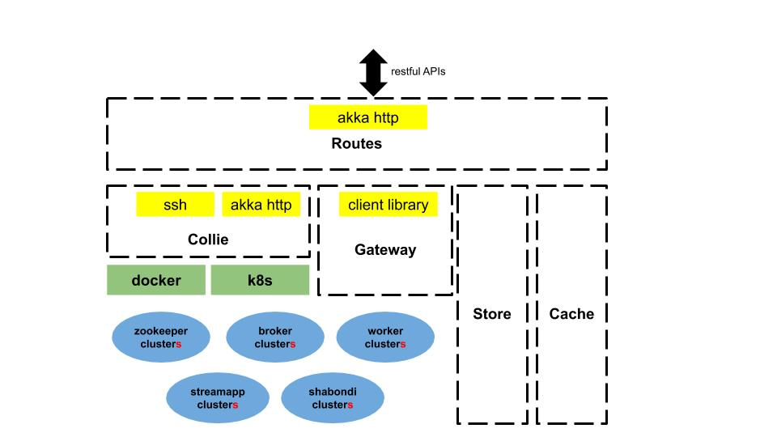

# User Guide

This documentation is for ohara users who try to exercise or test ohara without writing any code. Ohara team design and
implement ohara to provide a unparalleled platform which enable everyone to build streaming easily and quickly. For
normal users, you can manipulate ohara through UI interface even if you have no idea about the magic infra of ohara.
For advanced users trying to build custom streaming, they are encouraged to design and write application based on ohara's
various and powerful APIs (see [Custom Connector](custom_connector.md) and [Custom StreamApp](custom_streamapp.md)).

Ohara consists of many services, such as
1. [Ohara Configurator](#ohara-configurator) — the controller of ohara. It cooperates other services and provides the [Restful APIs](rest_interface.md) 
1. [Ohara Manager](#ohara-manager) — the UI service of ohara. It offers a streaming flow called **pipeline** 
1. [Zookeeper](#zookeeper) — works for Broker. It has charge of managing the configuration of topics and health of node
1. [Broker](#broker) — It provides the access of topics, topics' data durability and balance.
1. [Worker](#worker) — It hosts and execute [Connectors](custom_connector.md) 
1. [Docker](#docker) — It packages the confis, dependencies and binary required by services and execute them in a isolated environments
1. and [Kubernetes](#kubernetes) — a management tool of docker instances

Ohara has a complicated software stack but most services are almost transparent to you. For example, before creating a
topic on ohara, you ought to set up a zookeeper cluster and a broker cluster. There are , unfortunately, a bunch of configs which
you have to design and write for both cluster. Ohara auto-generates most configs for you as best as it can, and ohara offers
the the readable [Restful APIs](rest_interface.md) and friendly UI to you. All complicated configs are replaced by some
simple steps showed on UI. The [Quick Start](#quick-start) section teach you to exercise ohara easily and quickly.

----------

## Quick Start

The core component of ohara is [Configurator](#ohara-configurator). After installing [related tools](#installation), you can
set up a Configurator via following docker command.

```bash
docker run --rm -p 12345:12345 oharastream/configurator:0.5-SNAPSHOT --port 12345
```

> click [here](#execute-configurator) to see more options for configurator

And then you can also create a manager to provide a beautiful UI based on above Ohara Configurator.

```bash
docker run --rm -p 5050:5050 oharastream/manager:0.5-SNAPSHOT --port 5050 --configurator http://$ip:12345/v0
```

> Please replace the **ip** by your host's address

Open your browser (we recommend [Google Chrome](https://www.google.com/intl/zh-TW/chrome/)) and link to http://localhost:5050.

----------

## Installation

We all love docker, right? All ohara services are executed by docker container. However, it is ok to run ohara services
through [assembly file](../README.md#build-binary) if you really really really hate docker.

----------

### Network Configurations

We are trying to do everything for you. However, your network your problem (reference to
Hadoop's [motto](https://wiki.apache.org/hadoop/YourNetworkYourProblem). A bad network configurations can bring any kind of
exception in any time, and it is hard to diagnose your network problems. In order to make each container be able to find
each other, please ensure following common problems (reference to [Hadoop](https://wiki.apache.org/hadoop/YourNetworkYourProblem)
again) don't happen on your nodes.

1. DNS and reverse DNS broken/non-existent.
1. Host tables in the machines invalid.
1. Firewalls in the hosts blocking connections.
1. Routers blocking traffic.
1. Hosts with multiple network cards listening/talking on the wrong NIC.
1. Difference between the hadoop configuration files' definition of the cluster (especially hostnames and ports)
  from that of the actual cluster setup.

After validating your network configurations layer by layer, you could try filing issue on github if you still can't
get Ohara to work. 

----------

### Install Docker-ce on Centos

Docker has provided a great docs about installing docker-ce.
Please click this [link](https://docs.docker.com/install/linux/docker-ce/centos/).

----------

### Download Ohara Images

Ohara deploys docker images on [docker hub](https://hub.docker.com/u/oharastream). You can download images via `docker pull` command.
All images are list below.
1. oharastream/broker:0.5-SNAPSHOT
1. oharastream/zookeeper:0.5-SNAPSHOT
1. oharastream/connect-worker:0.5-SNAPSHOT
1. oharastream/configurator:0.5-SNAPSHOT
1. oharastream/manager:0.5-SNAPSHOT
1. oharastream/streamapp:0.5-SNAPSHOT

----------

### Execute Configurator

```sh
docker run --rm -p ${port}:${port} --add-host ${nodeHostName}:${nodeHostIP} oharastream/configurator:0.5-SNAPSHOT --port ${port} --hostname ${host} --node ${SshUserName}:${SshPassword}@${NodeHostName}:${SshPort}
```

- folder: the folder used to store data (default is random). Mount the volume if you want to keep your data after restarting Configurator
- port: bound by Configurator (default is random)
- add-host: add a host mapping to /etc/hosts in Ohara Configurator (nodeHostName:nodeHostIP)
- hostname: hostname to run Ohara Configurator (defaults to 0.0.0.0)
- node: run a Ohara Configurator with **pre-created** broker and zookeeper clusters (for testing purpose)

If `node` is not specified, the Ohara Configurator will be running without **pre-created** zookeeper and broker clusters. You will need to create them manually
through configruator's RESTful APIs.

**NOTED:** you should prepare the broker and zookeeper images in each node where pre-created clusters will be running at if you want to use the `node` option

**NOTED:** you can enable the jmx reporter via inputing two env variables - "JMX_HOSTNAME" and "JMX_PORT".
- "JMX_HOSTNAME" should be same as the host running Ohara Configurator container so as to access the jmx service in docker from outside.
- "JMX_PORT" should be opened by docker (for example, add "-p $JMX_PORT:JMX_PORT")

> All services host by Ohara Configurator are based on docker technique. By default Ohara Configurator use ssh to control the docker containers from remote
  nodes (see [Docker](#docker) section). In this mode, please make sure the ssh account added by [Node APIs](rest_interface.md#node) should have sudo
  permission to run docker command (see [here](https://docs.docker.com/install/linux/linux-postinstall/) for related steps). 

----------

#### Keep the data of Configurator

Ohara Configurator demand a folder to store [data](rest_interface.md) and [jars](rest_interface.md#jars). As Ohara
Configurator is running in docker container, you have to mount the volume, which is located on container host, on the
home folder of Ohara Configurator if you want to keep all data of Ohara Configurator. The following example is to mount
a local folder (/tmp/configurator) on /home/ohara/configurator of Ohara Configurator's container.

```bash
$ mkdir /tmp/configurator
$ docker run -v /tmp/configurator:/home/ohara/configurator \
         -p 12345:12345 \
         oharastream/configurator:0.5-SNAPSHOT \
         --port 12345 \
         --folder /home/ohara/configurator
```

The user account in docker container is **ohara**, and hence it would be better to set the folder under the **/home/ohara**.
Otherwise, you will encounter the permission error. Noted that you have tell Ohara Configurator to save data in the folder
referencing to the outside folder. Otherwise, Ohara Configurator flush all data to a random folder. 

----------

### Execute Manager

```sh
docker run --rm -p 5050:5050 oharastream/manager:0.5-SNAPSHOT --port 5050 --configurator http://localhost:12345/v0
```
- port: bound by manager (default is 5050)
- configurator: basic form of restful API of Ohara Configurator

----------

### Execute PostgreSQL Instance

```
docker run -d --rm --name postgresql -p 5432:5432 --env POSTGRES_DB=${DB_NAME} --env POSTGRES_USER=${USER_NAME} --env POSTGRES_PASSWORD=${PASSWORD} -it islandsystems/postgresql:9.2.24
```

- POSTGRES_DB: PostgreSQL DataBase name
- POSTGRES_USER: PostgreSQL login user name. **Note: POSTGRES_USER="user" is illegal to postgresql**
- POSTGRES_PASSWORD: PostgreSQL login password

----------

### Execute FTP Instance

```h
docker run --rm -p 10000-10011:10000-10011 oharastream/backend:0.5-SNAPSHOT com.island.ohara.testing.service.FtpServer --controlPort 10000 --dataPorts 10001-10011 --user ${UserName} --password ${Password} --hostname ${hostIP or hostName}
```

- controlPort: bound by FTP Server
- dataPorts: bound by data transportation in FTP Server

----------

## Ohara Configurator

Ohara consists of many services, and Ohara Configurator plays the most important rule which coordinates all services and
offers a bunch of restful APIs to user to get all under control. The brief architecture of Ohara Configurator is shown below.



The introduction of each components are shown below. Feel free to trace the component in which you have interest.
- [Route of Ohara Configurator](#route-of-ohara-configurator)
- [Store of Ohara Configurator](#store-of-ohara-configurator)
- [Cache of Ohara Configurator](#cache-of-ohara-configurator)
- [Collie of Ohara Configurator](#collie-of-ohara-configurator)
- [Client of Ohara Configurator](#client-of-ohara-configurator)

----------

### Route of Ohara Configurator

Ohara Configurator leverages the akka-http to implements the rest server and handle the conversion of json objects. You
can click our [docs](rest_interface.md) to see all public APIs and introduction. 

The APIs supported by Ohara Configurator is only the Restful APIs. Of course, you can raise a question to us - why we 
choose the Restful APIs rather than pure Java APIs? The answer is - We all hate the other programming language except for
the one we are using. However, we always need to work with other people who are typing terrible and weired code,
and all they want to do is to call your APIs. In order to save our time from co-working with them, providing the
Restful APIs is always to be our solution. For another reason, Ohara Configurator is not in charge of I/O flow. Coordinating
all services requires small bandwidth only. We don't need to care for the performance issue about Restful APIs.

> You can use our internal scala APIs to control Configurator. The library is called ohara-client and it covers all Restful APIs of Configurator.
    However, we don't guarantee any compatibility for ohara-client.

----------

### Store of Ohara Configurator

All settings you request to Ohara Configurator are saved in Store, such as connector settings, cluster information and
pipeline description. The default implementation of Store is [RocksDB](https://rocksdb.org/) which offers fast in-memory
access and persists all data on disk. Please read this [section](#keep-the-data-of-configurator) about mounting host's
folder on docker container.

----------

### Cache of Ohara Configurator

The cost of coordinating countless services is the big **latency**. For example, [Topic APIs](rest_interface.md#topic)
allows you to fetch metrics from different [broker clusters](rest_interface.md#broker). Ohara Configurator has to file
a bunch of connections to different clusters to retrieve all requisite information, and, of course, the **connections**
bring the large latency to the GET request. Hence, Ohara Configurator sets up a inner cache which stores the data from
remote clusters. It reduces the latency from seconds to milliseconds and allay your anger. In order to make all data
up-to-date as much as possible, the cache auto-refreshes timeout data in the background. It brings some extra cost of
building connections to remote clusters.

----------

### Collie of Ohara Configurator

Apart from the data flow, Ohara Configurator is also doable to manage clusters for you. For instance, you can
1. add [node](rest_interface.md#node) to Ohara Configurator
1. deploy a [zookeeper cluster](rest_interface.md#zookeeper) on the node
1. deploy a [broker cluster](rest_interface.md#broker) on the node as well
1. deploy a [worker cluster](rest_interface.md#worker) on the node
1. finally, you can run a connector to stream your data and all services you have created are hosted by Ohara Configurator

In order to host your services safely and quickly, Ohara Configurator leverages the Docker technique that all services are packaged to
a container and executed on the node(s) specified by you. As a good software stack, Ohara Configurator creates a container
manager, which is called **collie*, to wrap Restful APIs of [k8s](#kubernetes) and ssh command to Scala APIs.

----------

### Client of Ohara Configurator

As a good programmer, we all love to reuse the code. However, it is hard to trust all third-party libraries guarantee
the suitable compatibility policy. The Client code in ohara is a collection of wrap for all client codes to services, such as
broker and worker, so as not to be badly hurt by the update of services.

----------

## Ohara Manager

----------

## Zookeeper

[Zookeeper](https://zookeeper.apache.org/) plays a important rule in Ohara that it persists metadata for kafka and monitors
the running nodes of kafka. Setting up a zookeeper cluster is always the first phase before you start to use Ohara to host
your clusters. It may be weird, however, to you since this cryptic service is almost transparent to you. Currently, zookeeper
cluster exists only for kafka. At any rate, you are still doable to access zookeeper via any zk client if you have to.

As a result of algorithm used by zookeeper, we recommend your zookeeper cluster should have 2n + 1 nodes which can
address the best reliability and availability ([related discussion](https://stackoverflow.com/questions/4228227/what-does-2n-1-quorum-mean)).
In most cases, running a zookeeper cluster with 3 servers is enough to your production because we don't put our data flow
on zookeeper cluster. However, you should consider higher number of nodes if your production does care for the 
recovery time of node crash. More nodes in zookeeper cluster brings more time to you for fixing your broken zookeeper cluster.

Ohara is responsible for creating your zookeeper cluster, and hence Ohara also auto-generate most configs used by
a zookeeper cluster. A basic auto-generated configs file to zookeeper cluster is shown below.

```
tickTime=2000
initLimit=10
syncLimit=5
maxClientCnxns=60
clientPort=2181
dataDir=/tmp/zookeeper/data
server.0=node00:2888:3888
``` 

Most options are auto-generated by Ohara Configurator, and and [Zookeeper APIs](rest_interface.md#create-a-zookeeper-cluster)
displays the configurable settings to user.. Feel free to file a issue to Ohara community if you have better configs for zookeeper.

----------

## Broker

After setting up a [Zookeeper cluster](#zookeeper), you have to build a broker cluster before going on your streaming trip.
[Broker](https://kafka.apache.org/intro) is the streaming center of ohara that all applications on ohara goes through brokers to switch data.
There are many stories about Ohara leverages the broker to complete countless significant works. But the most important usage
of Brokers for ohara is the [Topic](rest_interface.md#topic). Each endpoint in [Pipeline](rest_interface.md#pipeline)
must connect to/from a topic, and each topic in ohara is mapped to a topic in broker. It means all data sent/received to/from
topic is implemented by a true connection to a broker.

As a result of addressing scalability, a topic is split to many **partitions** distributed on different brokers. It implies
the number of brokers directly impact the performance of ohara [Pipeline](rest_interface.md#pipeline). If you are streaming
a bunch of data and there is only a broker in your broker cluster, you will get a slow streaming since all data in the
streaming are processed by the single broker. Hence, please be careful on deploying your broker cluster. But you don't
worry about the incorrect settings to cluster. Ohara provides many flexible [Broker APIs](rest_interface.md#broker)
to increase/decrease nodes of a running broker cluster. You are able to scale your cluster up/down arbitrarily via Ohara APIs.

In order to simplify your life, Ohara auto-generate most configs for your broker cluster.

```
num.network.threads=3
num.io.threads=8
socket.send.buffer.bytes=102400
socket.receive.buffer.bytes=102400
socket.request.max.bytes=104857600
num.partitions=1
num.recovery.threads.per.data.dir=1
offsets.topic.replication.factor=1
transaction.state.log.replication.factor=1
transaction.state.log.min.isr=1
log.retention.hours=168
log.segment.bytes=1073741824
log.retention.check.interval.ms=300000
zookeeper.connection.timeout.ms=6000
group.initial.rebalance.delay.ms=0
broker.id=0
listeners=PLAINTEXT://:9092
log.dirs=/tmp/broker/data
zookeeper.connect=node00:2181
advertised.listeners=PLAINTEXT://node00:9092
```

Most options are auto-generated by Ohara Configurator, and [Broker APIs](rest_interface.md#create-a-broker-cluster)
displays the configurable settings to user. Ohara community always welcomes user to raise
issue about **we should give a better default configs** or **we should enable user to change xxx config**.

----------

## Worker

In contrast with [Broker](#broker), Worker takes charge of hosting and distributing your applications. Via Ohara Configurator
you can deploy applications on a worker cluster. Worker executes your application on a single thread and handle following issues for you.

1. tolerance - worker cluster auto-migrate your application from a dead node to another live one.
1. distribution - you can decide the number of threads invoked by worker cluster to run your applications. Of course, the
                 threads are distributed across whole cluster.
1. Data - Worker is in charge of fetching/pushing data from/to topics specified by your application. All you have to do
         is to process the data.
1. consistency - The offset of data in/from topics are auto-record by worker. Also, for advanced user, there are
                a lot of offset-related APIs, which is exposed to your application, that you can control the offsets of data.
1.balance - worker cluster keeps tracing the loading for each worker node and auto-balance the loading for heavy one.
            Via [Ohara APIs](rest_interface.md#worker), you can increase the node of a running worker cluster easily if
            you do want to scala the throughput up.
            
Setting up a worker cluster also requires many configurations. Ohara Configurator auto-fill the following settings for
you when you request to create a worker cluster.

```
key.converter=org.apache.kafka.connect.json.JsonConverter
value.converter=org.apache.kafka.connect.json.JsonConverter
key.converter.schemas.enable=true
value.converter.schemas.enable=true
offset.flush.interval.ms=10000
internal.key.converter=org.apache.kafka.connect.json.JsonConverter
internal.value.converter=org.apache.kafka.connect.json.JsonConverter
internal.key.converter.schemas.enable=false
internal.value.converter.schemas.enable=false
group.id=339f4352b3
offset.storage.topic=offset-8e5c68825d
offset.storage.replication.factor=1
offset.storage.partitions=1
config.storage.topic=setting-2b86167398
config.storage.replication.factor=1
status.storage.topic=status-4841be564b
status.storage.replication.factor=1
status.storage.partitions=1
plugin.path=/tmp/plugins
bootstrap.servers=node00:9092
rest.port=8083
rest.advertised.host.name=node00
rest.advertised.port=8083
```

Most options are auto-generated by Ohara Configurator, and [Worker APIs](rest_interface.md#create-a-worker-cluster) displays
the configurable settings to user. Welcome you to file a issue to request more control right of worker cluster.

----------

## Docker

All services host by Ohara are based on docker containers, such as [Configurator](#ohara-configurator), [Manager](#ohara-manager),
[Zookeeper](#zookeeper), [Broker](#broker) and [Worker](#worker). You should install suggested version of Docker before
enjoying Ohara service (see [Readme](../README.md) for prerequisite).

The post-installation for all docker nodes are listed below.
1. [Install the supported version of docker](../README.md) — Ohara community does not support the legacy docker.
1. [download all ohara images](#download-ohara-images) —
  Ohara Configurator expect all images are available from local disk rather than network.
1. [create a user account which can access docker without sudo](https://docs.docker.com/install/linux/linux-postinstall/) —
  Ohara Configurator may use ssh to control docker of remote node.

----------

## Kubernetes
